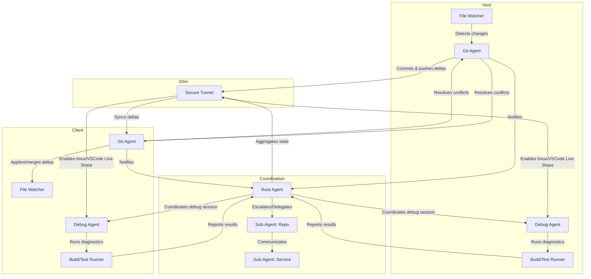

## Adaptive Git Sandbox & Agent Hierarchy (Mermaid)



AI: DO NOT TOUCH

# LiteBike

## Defaults and Tools

- Default ingress interface: `s?w?lan*,en*`
- Default egress interface: `rmnet*` (with backoff logic)
- Unified proxy port: `8888`
- Drop-in replacements: `ifconfig`, `netstat`, `route`, `ip`
- Cross-platform: Android/Termux, macOS, Linux

## Actual Codebase Specifications

### Binaries & Entrypoints
- Main binary: `litebike` (argv0-dispatch)
- Hardlink/symlink invocation: acts as `ifconfig`, `ip`, `route`, `netstat` (minimal syscall-only implementations)
- Additional commands: `probe`, `domains`, `carrier`, `radios`, `snapshot`, `watch`

### Supported Commands
- `litebike ifconfig [iface]` — List interfaces and addresses
- `litebike ip [args]` — IP utility emulation
- `litebike route` — Print routing table
- `litebike netstat [args]` — Show socket states
- `litebike probe` — Show best-effort egress selections for v4/v6
- `litebike domains` — Domain info utility
- `litebike carrier` — Carrier info utility
- `litebike radios [args]` — Radio info utility
- `litebike snapshot [args]` — Print config snapshot
- `litebike watch [args]` — Watch utility

### Configuration
- Environment variables:
		- `LITEBIKE_BIND_PORT` (default: 8888)
		- `LITEBIKE_INTERFACE` (default: swlan0)
		- `LITEBIKE_LOG` (default: info)
		- `LITEBIKE_FEATURES` (comma-separated)
		- `EGRESS_INTERFACE` (default: auto)
		- `EGRESS_BIND_IP` (default: auto)
		- `LITEBIKE_BIND_ADDR` (optional)

### Protocol Support
- Multi-protocol detection on unified port (HTTP, SOCKS5, TLS, DoH, PAC/WPAD, Bonjour, UPnP)
- Protocols enumerated in code: HTTP, HTTPS, SOCKS5, TLS, DNS, DoH, PAC, WPAD, Bonjour, UPnP, and many more (see `src/types.rs`)

### System Utility Emulation
- All tools use direct syscalls via `libc` (no /proc, /sys, /dev on Android)
- Netlink sockets for routing info
- ioctl for interface enumeration
- Minimal Rust wrappers, C-style code for compatibility

### Testing & Examples
- Integration/unit/bench scaffolding in `tests/`
- Example: list interfaces and default gateway
		```rust
		use litebike::syscall_net::{list_interfaces, get_default_gateway};
		fn main() -> std::io::Result<()> {
			let ifaces = list_interfaces()?;
			for (name, iface) in ifaces {
				println!("{}: {:?}", name, iface.addrs);
			}
			if let Ok(gw) = get_default_gateway() {
				println!("Default gateway: {}", gw);
			}
			Ok(())
		}
		```


## Features

- **Bonjour-Powered Auto-Discovery:** The key to a seamless, plug-and-play experience.
- **Versatile Proxying:** A robust, multi-protocol proxy server that handles modern web traffic.
- **UPnP Support:** Enables automatic port forwarding when needed.
- **`proxy-bridge` Script:** A companion script that automates the tedious task of setting and clearing proxy configurations in all your common shell (`.*rc`) files.
- **Cross-Platform**: Works on Android/Termux, macOS, Linux without modification.
- **Legacy Compatibility**: Drop-in replacement for `ifconfig`, `netstat`, `route`, `ip`.

## Network Interface Handling

LiteBike is designed to intelligently manage network interfaces for optimal proxying:

- **Default Ingress:** The proxy typically listens on WiFi interfaces, often matching patterns like `s?wlan*`.
- **Default Egress:** Outgoing traffic is routed through mobile data interfaces, commonly `rmnet*`, with built-in backoff logic for reliable connectivity.
 