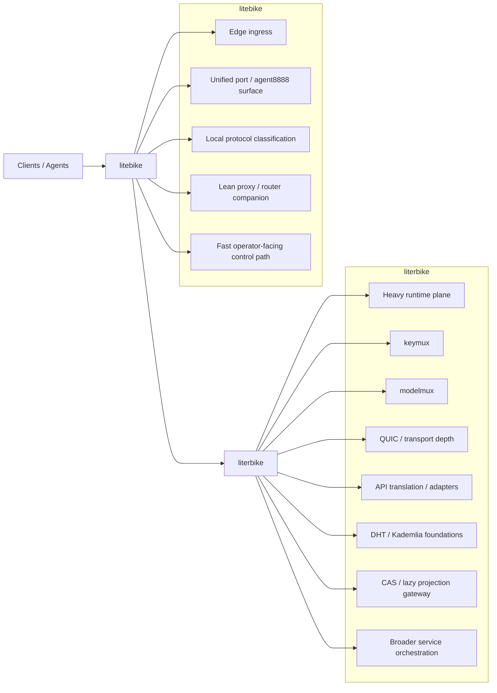

# Litebike / Literbike Split Chart

This chart captures the intended product boundary as local launch truth.

## Short Read

- `litebike` owns the edge-facing ingress and the canonical `8888` operator
  surface.
- `literbike` owns the heavier runtime, including `keymux`, `modelmux`, deeper
  transport, adapters, and longer-horizon service/storage work.
- The intended handoff is: classify early in `litebike`, then route heavier
  transport/service/runtime work into `literbike`.
